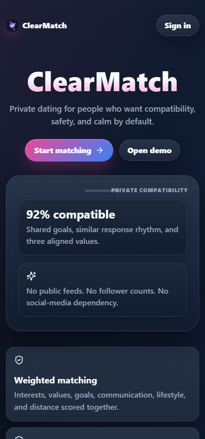
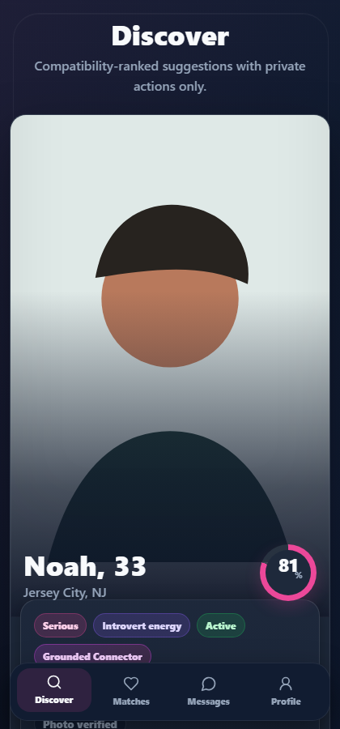
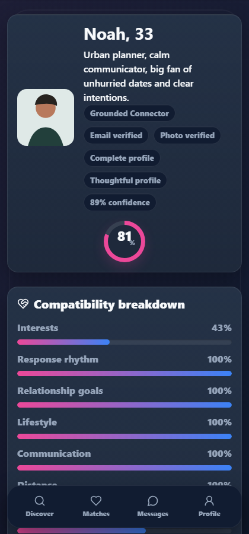
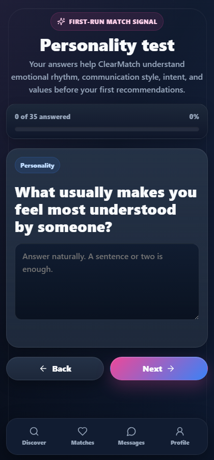

# ClearMatch


ClearMatch is a private full-stack dating app demo focused on explainable compatibility, mutual-match messaging, and anti-drama safety defaults.

## UI previews

<p align="center">
  
  
  
  
</p>

## Stack

- Vite, React, TypeScript, plain CSS
- Node.js, TypeScript, Express
- WebSockets with `ws`
- MongoDB data model with Prisma
- In-memory local demo data for instant portfolio review

## Project structure

- `frontend/`: Vite, React, TypeScript, plain CSS.
- `backend/`: Express, WebSockets, Prisma MongoDB schema, API services.
- `python-service/`: FastAPI conversation fade scoring service.
- `shared/`: shared TypeScript types and base matching logic.
- `services/`: Phase 2 matching, behavior, conversation, and trust engines.
- `docs/`: deeper Phase 2 architecture notes.

## Local setup

```bash
npm install
python -m pip install -r python-service/requirements.txt
cp .env.example .env
npm run dev
```

Open `http://localhost:5173`.

The API runs on `http://localhost:4100` by default. The Python fade service runs on `http://localhost:8000`. Vite proxies `/api` and `/uploads` to the backend.

## Docker setup

```bash
docker compose up --build
```

Open `http://localhost:5173`.

The Compose stack runs:

- `frontend`: nginx serving the Vite build and proxying `/api`, `/uploads`, and `/ws`.
- `backend`: Express and WebSocket API on port `4100`.
- `python-service`: FastAPI conversation fade engine on port `8000`.

Demo account:

```text
demo@clearmatch.app
ClearMatch123!
```

## Database setup

The local demo runs without MongoDB so the product can be reviewed immediately. For a persistent environment:

1. Create a MongoDB database.
2. Set `DATABASE_URL` in `.env`.
3. Run `npm run prisma:generate`.
4. Run `npm run prisma:push`.
5. Replace the in-memory store in `server/src/store.ts` with Prisma repository calls using the schema in `prisma/schema.prisma`.

## Core flows

- Signup and login with email/password.
- Age-gated profile setup.
- Photo upload endpoint with MIME and size validation.
- Discover queue ranked by compatibility score.
- Like, pass, standout like, mutual match creation, and undo last pass.
- Match detail explanations with shared interests, matched goals, differences, and recommendation reasons.
- WebSocket chat unlocked only after mutual match.
- Typing indicator, read receipt events, report, block, hide profile, pause account, and moderation queue.
- No public feed, comments, followers, reposting, mutual-friend display, or social-media linking.

## Scripts

- `npm run dev`: run Python fade service, frontend, and backend together.
- `npm run dev:python`: run only the FastAPI fade service.
- `npm run dev --workspace frontend`: run Vite only.
- `npm run dev --workspace backend`: run Express/WebSocket server only.
- `npm run build`: type-check and build the Vite app.
- `npm run prisma:push`: push Prisma MongoDB schema.
